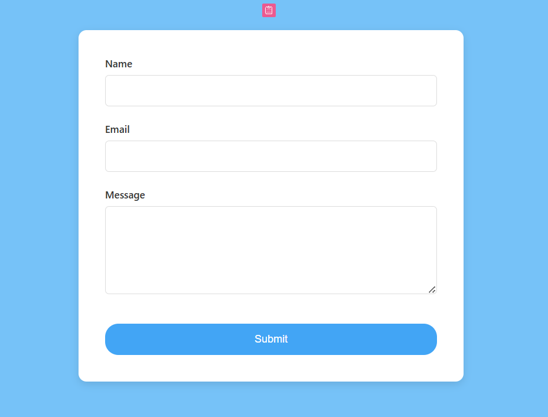

# React Contact Form

A simple contact form application built with React, TypeScript, and Vite using the `useForm` hook from `react-hook-form`.

## Features

- Name field (required)
- Email field (required with email format validation)
- Message field (required)
- Form validation with error messages

## Screenshots

## Run

1. Clone or download this repository.
2. Install dependencies: `npm install`
3. Start the development server: `npm run dev`

